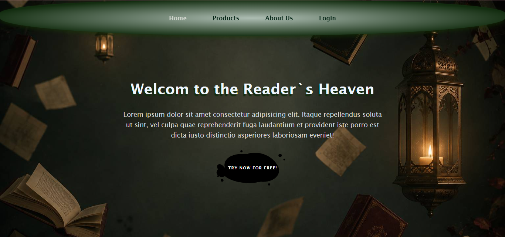
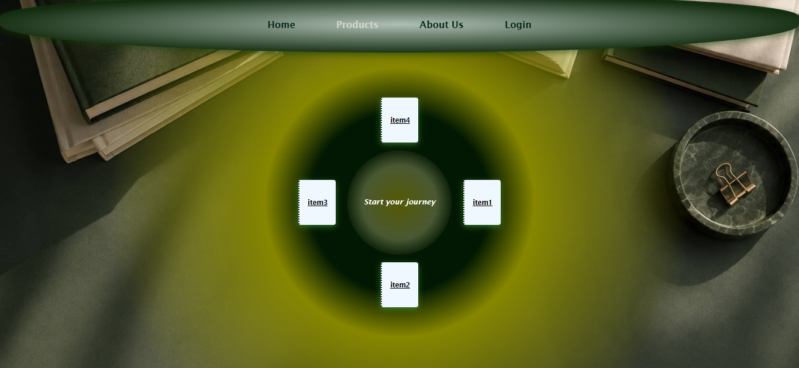
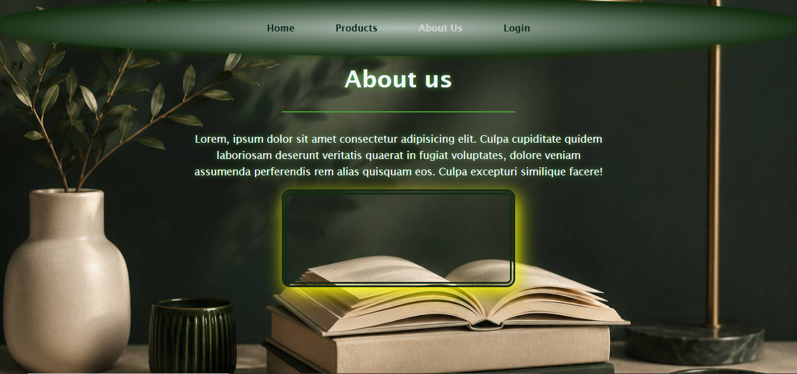
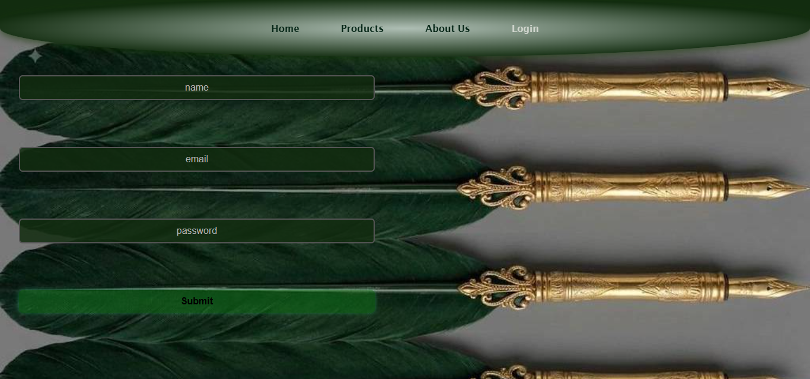

# 📖 Book Shop — Reader's Heaven 📚

Welcome to my very first web development project! Built entirely from scratch using pure <b>HTML5</b> and <b>CSS3</b>, this project is a fully responsive e-commerce platform designed for book lovers and literature enthusiasts.

## 🛠️ Built With

## 📸 Project Previews

### 🏠 Home Page

### 🛍️ Products Page

### 🎬 About Page

### 🔐 Login Page

## ✨ Key Highlights

✔️ <b>100% Custom Design & Layout:</b> Designed with full creative freedom, featuring an immersive forest-green aesthetic, dark glassmorphism cards, and cozy literature-themed visuals.

✔️ <b>Fully Responsive:</b> Seamlessly adapts to all screen sizes—from mobile devices to ultra-wide monitors.

✔️ <b>Pure CSS Effects:</b> Built with modern CSS techniques including flexbox, clamp() typography, CSS gradients, and interactive hover animations.

Feel free to explore the repository and live demo! 🚀

